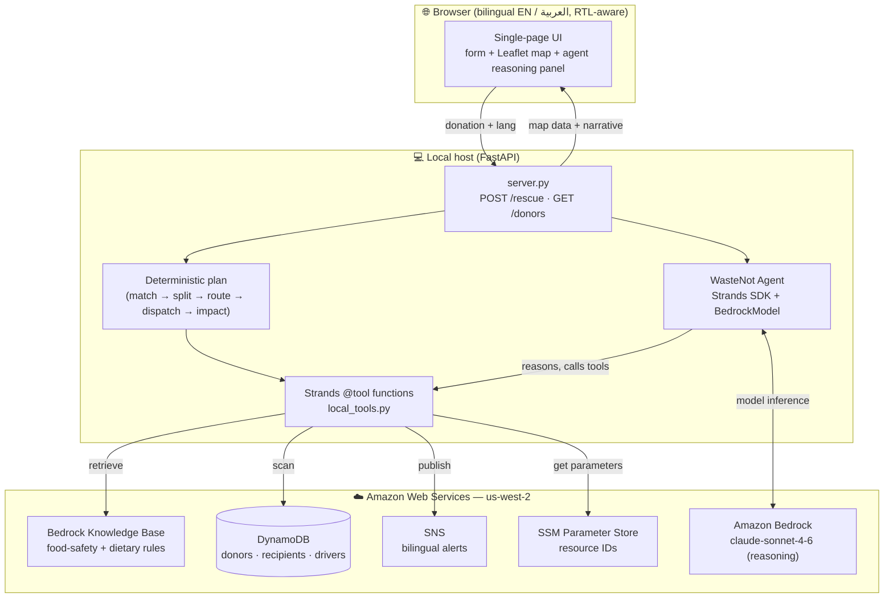
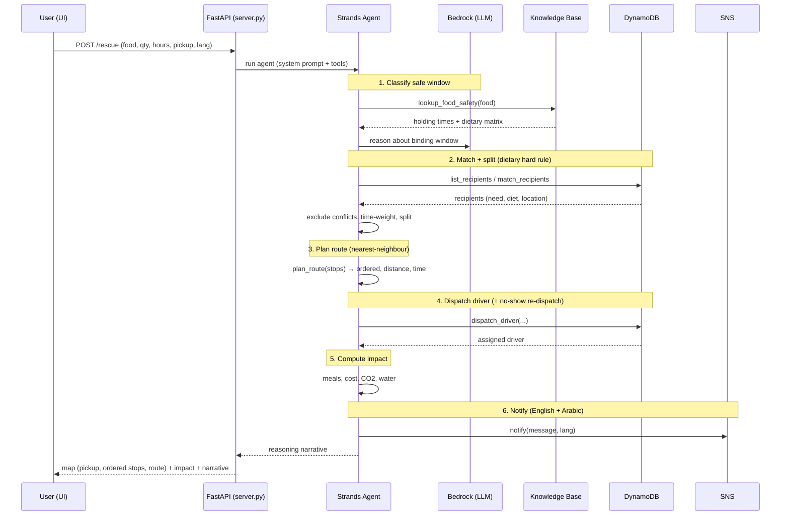

# WasteNot — Architecture & Flow

WasteNot is an agentic food-rescue system. A restaurant reports surplus meals; the
agent classifies safe-holding time, matches dietary-compatible recipients, splits and
routes the delivery, dispatches a driver, and reports impact — explaining every step.

The agent runs **locally** (FastAPI) using the **Strands Agents SDK** with **Amazon
Bedrock** for reasoning. Tools call the workshop's pre-provisioned AWS resources
directly (DynamoDB, Bedrock Knowledge Base, SNS). This avoids the AgentCore gateway /
CDK deploy path, which the locked-down workshop participant role cannot bootstrap.

## System architecture

## Rescue flow (per submission)

## Agent tools (local_tools.py)

| Tool | Purpose | AWS service |
|------|---------|-------------|
| `lookup_food_safety` | Safe holding time + dietary rules | Bedrock Knowledge Base |
| `list_recipients` | Recipients with need, diet, location | DynamoDB |
| `match_recipients` | Dietary-safe, time-weighted matching + split | DynamoDB |
| `plan_route` | Nearest-neighbour multi-stop ordering | (compute) |
| `dispatch_driver` | Assign driver; re-dispatch on no-show | DynamoDB |
| `compute_impact` | Meals rescued, cost, CO₂, water avoided | (compute) |
| `notify` | Bilingual (EN/AR) alert | SNS |

## Distinctive capabilities

- **Real-time matching + routing** — the core differentiator.
- **Beat the clock** — matches are weighted by time left vs. drive time.
- **Split donations** — a large surplus is divided across nearby recipients on one route.
- **Dietary hard rule** — vegetarian/vegan food satisfies halal; conflicts never matched.
- **Regional relevance** — bilingual EN/Arabic UI (RTL) and notifications; halal-aware.
- **Explainable** — the agent narrates each decision in the selected language.
